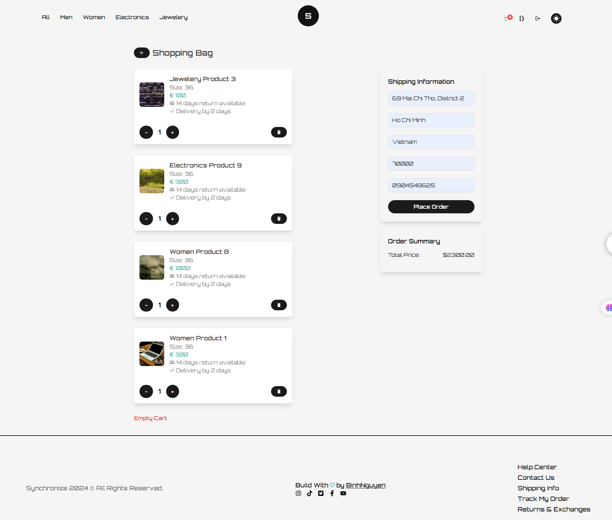

# Synchrnonize Ecommerce


## Project Description

The project was done as a final project at [Integrify](https://www.integrify.io/) bootcamp. It will offer core functionality concepts for a typical Ecommerce Website.

## Project overview

This repository contains the backend server for an E-Commerce Platform. The project implements RESTful API endpoints for managing users, products, orders, carts, categories, and reviews.

**NOTE**: The frontend repository can be found [here](https://github.com/tripplen23/fs17-Frontend-project)

Link to deployed Frontend Web UI: [Frontend](https://fs17-frontend-project-zln9-kl59btf0o.vercel.app/)

Link to deployed Backend Server: [Backend](https://sync-ecommerce.azurewebsites.net/index.html)

## Table of Contents

1. [Technologies](#technologies)
2. [Getting Started](#getting-started)
3. [User Interface](#user-interface)
4. [Project Structure](#project-structure)
5. [Data Flow](#data-flow)

## Technologies

- TypeScript: `^4.9.5`
- React: `^18.2.0`
- Node Js: v18.14.2
- Git
- Package Manager: Either npm or Yarn
  - npm version: `^8.4.1`
  - Yarn version:`^1.22.10`
- TailwindCSS `^4.9.5`

## Getting Started

1. Open your terminal and clone the repository with the following command:

`git clone https://github.com/tripplen23/synchronize-ecommerce.git`

2. Navigate to the project directory:

`cd fs17-Frontend-project`

3. Install all the packages:

`npm i` or `yarn`

4. Start the application in your local machine:

`npm start`

## User Interface

1. Authentication:


2. Home Page:


3. Catalog Page:


4. Single Product Page:


5. Cart Page:




6. Order Page:


7. Profile Page:


8. Admin Dashboard:


## Project Structure

```sh
└── /src
    ├── App.css
    ├── App.tsx
    ├── index.css
    ├── index.tsx
    ├── react-app-env.d.ts
    ├── reportWebVitals.ts
    ├── setupTests.ts
    ├── asset
    ├── components
    |   ├── layouts
    |   |    ├── Footer
    |   |    ├── Header
    |   |    ├── index.tsx
    |   ├── reusable
    |   |    ├── ButtonComponent
    |   |    ├── CustomNavComponents
    |   |    ├── GoToTopComponent
    |   |    ├── IconComponent
    |   |    ├── LogoComponent
    |   |    ├── ModalComponent
    |   |    ├── Notification
    |   |    ├── ProductCardComponent
    |   |    ├── SpinnerComponent
    |   |    └── TransitionEffect
    ├── constants
    |   ├── Route.ts
    |   └── Status.ts
    ├── data
    ├── hooks
    │   └── useThemeSwitcher.ts
    ├── misc
    │   ├── authType
    │   ├── cartType
    │   ├── categoryType
    │   ├── enum
    │   ├── orderType
    │   ├── productType
    │   └── userType
    ├── pages
    │   ├── AdminDashboard
    │   ├── Auth
    │   ├── Cart
    │   ├── Catalog
    │   ├── CustomerProfile
    │   ├── Home
    │   ├── Order
    │   └── Product
    ├── redux
    |   ├── features
    |   |    ├── auth
    |   |    ├── cart
    |   |    ├── category
    |   |    ├── order
    |   |    ├── product
    |   |    ├── slider
    |   |    └── user
    │   └── utils
    |   |    ├── newAxiosConfig.ts
    |   |    ├── hook.ts
    |   |    └── store.ts
    ├── routes
    │   ├── PrivateRouteProps.tsx
    │   ├── ProtectedRoute.tsx
    │   └── Routes.tsx
    ├── shared¨
    │   └── authMSW.ts
    └── style
        └── toastify.css
```

### Data Flow

- The main logic of the app is implemented in the slice files (for example: productSlice, cartSlice, authSlice, etc). The slice files are connected to the service files (for example: productService, cartService and authService, etc) which play the role as the bridges between the API and the redux store. The redux store after being processed all the logic with the API will be implemented in the application through the the hooks of useAppSelector for selecting the state and the useAppDispatch for triggering the state to the redux store.

