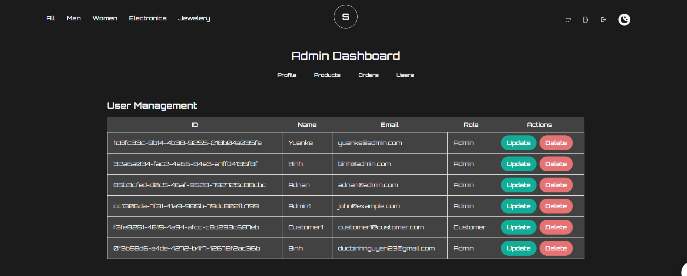

# Synchrnonize Ecommerce


## Project Description

The project was developed as a final project at the [Integrify](https://www.integrify.io/) bootcamp. It offers core functionality for a typical E-commerce website, designed to serve as a base for selling fashion and jewelry products for Synchronize Recording Studio.

## Project overview

This repository contains the frontend source code for an E-commerce sample application. The project includes the implementation of a RESTful API for managing users, products, orders, carts, categories, and reviews (in the future!).

**NOTE**: The backend repository can be found [here](https://github.com/tripplen23/synchronize-server)

Link to deployed Frontend Web UI: [Frontend](https://fs17-frontend-project-zln9-kl59btf0o.vercel.app/)

Link to deployed Backend Server: [Backend](https://sync-ecommerce.azurewebsites.net/index.html)

## Table of Contents

1. [Technologies](#technologies)
2. [Getting Started](#getting-started)
3. [User Interface](#user-interface)
4. [Project Structure](#project-structure)
5. [Data Flow](#data-flow)

## Technologies

- **TypeScript**: `^4.9.5`
- **React**: `^18.2.0`
- **Node.js**: `v18.14.2`
- **Git**
- **Package Manager**: Either npm or Yarn
  - npm: `^8.4.1`
  - Yarn: `^1.22.10`
- **TailwindCSS**: `^3.4.1`

## Getting Started

1. Open your terminal and clone the repository with the following command:

   ```sh
   git clone https://github.com/tripplen23/synchronize-ecommerce.git

   ```

2. Navigate to the project directory:

   ```sh
   cd fs17-Frontend-project

   ```

3. Install all the packages:

   ```sh
    npm install
    # or
    yarn
   ```

4. Start the application in your local machine:

   ```sh
    npm start
    # or
    yarn start
   ```

## User Interface

### 1. Authentication


### 2. Home Page


### 3. Catalog Page


### 4. Single Product Page


### 5. Cart Page


### 6. Order Page


### 7. Profile Page


### 8. Admin Dashboard




### 9. Toasters


## Project Structure

```sh
└── /src
    ├── App.css
    ├── App.tsx
    ├── index.css
    ├── index.tsx
    ├── react-app-env.d.ts
    ├── reportWebVitals.ts
    ├── setupTests.ts
    ├── asset
    |   ├── fonts
    |   └── imgs
    ├── components
    |   ├── layouts
    |   |    ├── Footer
    |   |    ├── Header
    |   |    └── index.tsx
    |   ├── reusable
    |   |    ├── ButtonComponent
    |   |    ├── CustomNavComponents
    |   |    ├── GoToTopComponent
    |   |    ├── IconComponent
    |   |    ├── LogoComponent
    |   |    ├── ModalComponent
    |   |    |    ├── AddingProductModalComponent.tsx
    |   |    |    ├── ModalComponent.tsx
    |   |    |    ├── UpdatingOrderModalComponent.tsx
    |   |    |    ├── UpdatingProductModalComponent.tsx
    |   |    |    └── UpdatingUserModalComponent.tsx
    |   |    ├── ProductCardComponent
    |   |    ├── ProfileComponent
    |   |    |    ├── OrderHistoryTable.tsx
    |   |    |    └── ProfileModal.tsx
    |   |    ├── SpinnerComponent
    |   |    └── TransitionEffect
    ├── constants
    |   ├── Route.ts
    |   └── Status.ts
    ├── data
    ├── helpers
    │   └── getImageData.ts
    ├── hooks
    │   └── useThemeSwitcher.ts
    ├── misc
    │   ├── authType.ts
    │   ├── cartType.ts
    │   ├── categoryType.ts
    │   ├── enum.ts
    │   ├── orderType.ts
    │   ├── productType.ts
    │   └── userType.ts
    ├── pages
    │   ├── AdminDashboard
    |   |    ├── AdminOnly
    |   |    |    ├── AdminProfile.tsx
    |   |    |    ├── AdminOrder.tsx
    |   |    |    ├── AdminProduct.tsx
    |   |    |    ├── AdminProfile.tsx
    |   |    |    ├── AdminReview.tsx
    |   |    |    └── AdminUser.tsx
    |   |    └── AdminDashboard.tsx
    │   ├── Auth
    |   |    ├── Login.tsx
    |   |    └── Register.tsx
    │   ├── Cart
    |   |    ├── CartModal
    |   |    |    ├── CartModal.tsx
    |   |    |    ├── CartModalItem.tsx
    |   |    |    └── CartModalSummary.tsx
    |   |    ├── Cart.tsx
    |   |    ├── CartItem.tsx
    |   |    ├── CartLeft.tsx
    |   |    ├── CartRight.tsx
    |   |    └── EmptyCart.tsx
    │   ├── Catalog
    │   ├── CustomerProfile
    │   ├── Home
    │   ├── Order
    │   └── Product
    ├── redux
    |   ├── features
    |   |    ├── auth
    |   |    |    ├── authReducer.test.ts
    |   |    |    ├── authService.ts
    |   |    |    └── authSlice.ts
    |   |    ├── cart
    |   |    |    ├── cartService.ts
    |   |    |    └── cartSlice.ts
    |   |    ├── category
    |   |    |    ├── categoryService.ts
    |   |    |    └── categorySlice.ts
    |   |    ├── order
    |   |    |    ├── orderService.ts
    |   |    |    └── orderSlice.ts
    |   |    ├── product
    |   |    |    ├── productService.ts
    |   |    |    └── productSlice.ts
    |   |    ├── slider
    |   |    |    └── sliderSlice.tsx
    |   |    └── user
    |   |    |    ├── userService.ts
    |   |    |    └── userSlice.ts
    │   └── utils
    |   |    ├── newAxiosConfig.ts
    |   |    ├── hook.ts
    |   |    └── store.ts
    ├── routes
    │   ├── PrivateRouteProps.tsx
    │   ├── ProtectedRoute.tsx
    │   └── Routes.tsx
    ├── shared
    │   └── authMSW.ts
    └── style
        └── toastify.css
```

## Data Flow

### 1. Redux store logic and authentication policies:


### 2. Data flow:


